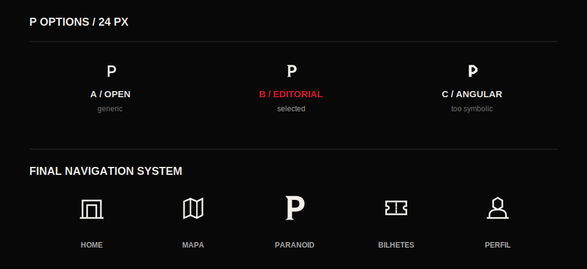

# Paranoid Mobile Simplification V1

## Objetivo

Reduzir a experiência mobile a cinco ideias: descobrir na Home, encontrar no Mapa, perguntar no Hub, entrar com Bilhetes e gerir no Perfil. A alteração é uma camada reversível sobre a arquitetura existente; não cria outro Hub, outro motor de descoberta ou novas rotas.

O desktop mantém o header e a experiência do Discovery Engine anteriores. Dark mode continua a ser a expressão principal, com os mesmos tokens funcionais em light mode.

## Auditoria da tentativa anterior

O código da primeira tentativa estava versionado no commit `d5bfc52`, mas continha problemas que impediam a experiência de funcionar como desenhada:

- a Home mobile tinha `overflow: hidden`, 711 px de altura visível e mais de 1000 px de conteúdo a 390 px, cortando o feed sem permitir scroll;
- mobile e desktop eram montados ao mesmo tempo, provocando dois feeds, dois pedidos ao endpoint e IDs `discovery-title` duplicados;
- o P ganhava uma diagonal no estado ativo e passava a parecer um R, inclusive no header desktop;
- a splash corria no desktop e podia consumir a sessão antes de uma abertura mobile;
- um item de feed podia mostrar quatro ações em simultâneo;
- `FeedArtistItem` existia sem ser utilizado nem ter uma origem de dados;
- a flag mobile ativava também o Discovery Feed desktop, mesmo quando a flag específica desse produto estava desligada;
- o Hub atualizava o contexto, mas não minimizava nem indicava que o feed estava a ser ajustado.

O estado auditado compilava: TypeScript e build passavam, e o lint tinha apenas 14 avisos anteriores fora desta fase. As falhas eram de montagem, responsividade e comportamento.

## Feature flag e reversão

Ativar:

```env
NEXT_PUBLIC_MOBILE_SIMPLIFICATION_ENABLED=true
```

Desativar e fazer novo deploy/build para recuperar a experiência anterior:

```env
NEXT_PUBLIC_MOBILE_SIMPLIFICATION_ENABLED=false
```

Com a flag desativada, o shell volta a montar `MobileBottomNav`, o header mobile completo e a Home anterior. `NEXT_PUBLIC_DISCOVERY_FEED_ENABLED` continua suportada; a simplificação mobile também ativa o feed de descoberta porque a nova Home depende do motor já existente.

A variável deve existir em `.env.local` durante desenvolvimento e ser configurada separadamente em Vercel Preview e Vercel Production. Como é `NEXT_PUBLIC_`, o valor fica incorporado durante o build. Variável ausente ou qualquer valor diferente de `true` mantém a experiência anterior.

`NEXT_PUBLIC_DISCOVERY_FEED_ENABLED` continua a controlar a experiência Discovery no desktop. A API aceita pedidos quando qualquer uma das duas experiências precisa do motor, sem obrigar a nova flag mobile a redesenhar o desktop.

## Navegação final

| Destino | Rota | Função |
| --- | --- | --- |
| Home | `/` | Descobrir |
| Mapa | `/mapa` | Encontrar |
| P | overlay, sem mudança de rota | Perguntar |
| Bilhetes | `/bilhetes` | Entrar |
| Perfil | `/perfil` | Gerir |

Agenda e Loja saem apenas dos cinco lugares fixos. `/agenda` e `/loja` permanecem acessíveis através do feed, entidades, Hub, Perfil e ligações existentes.

## Home e Feed

No mobile, a Home não monta um hero, grelha de atalhos ou introdução. A ordem é:

1. trigger compacto do Hub;
2. contexto e sinais atuais devolvidos pelo Discovery Engine;
3. feed vertical de entidades publicadas.

`DiscoveryFeed` mantém o modo compacto para desktop e `/para-ti`, e acrescenta o modo `immersive` para a Home mobile. Apenas um destes branches é montado em cada viewport, evitando pedidos e IDs duplicados. Ambos usam o mesmo `/api/discovery`, ranking, interações e dados Supabase. Não são introduzidos dados de demonstração.

Os componentes utilizados `FeedItem`, `FeedEventItem`, `FeedVenueItem` e `FeedSignalItem` partilham a mesma base editorial. O feed atual produz eventos, espaços, promoções, produtos e comunidades. O contrato base aceita novas entidades no futuro sem manter adaptadores mortos enquanto não houver candidatos reais.

Imagens reais são carregadas de forma lazy. Não existe atualmente um campo de vídeo confirmado no contrato do Discovery Engine; o feed não inventa vídeos e essa origem fica como trabalho futuro.

Cada item expõe no máximo duas ações principais. Eventos mostram Guardar e a ação principal; outras entidades mostram ação principal e ação secundária, ou Perguntar à Paranoid quando não existe uma segunda ação real.

## Hub

`SmartHub` continua a ser o único cliente de conversa. A memória foi extraída para `lib/hub/client-history.ts`, mantendo a chave de `sessionStorage` existente e o limite de 32 trocas.

O trigger da Home e o P da navegação abrem `HubOverlayProvider`, que monta o mesmo `SmartHub`. Uma pergunta escreve na mesma sessão e emite um evento interno; a Home recebe o histórico e volta a pedir o feed com intenção e contexto atualizados.

O overlay:

- preserva a posição de scroll da página;
- não muda a rota;
- fecha por backdrop, botão, Escape ou gesto descendente na pega mobile;
- não foca automaticamente o campo ao abrir em dispositivos touch;
- esconde a navegação quando o teclado reduz o viewport.

Depois de uma resposta válida na Home, o histórico atualiza o Discovery Context, surge feedback discreto e o sheet minimiza. Quando a resposta pede mais um detalhe, o Hub permanece aberto. Noutras páginas permanece aberto sobre o contexto atual.

## Paranoid Icon System

Os símbolos são SVG inline originais, usam `currentColor`, partilham viewbox, proporção, espessura e geometria angular. Não dependem de Lucide, Heroicons, Material Icons ou emojis.



| Símbolo | Construção | Estado ativo |
| --- | --- | --- |
| Home | portal retangular monumental | estrutura interior preenchida |
| Mapa | mapa territorial dobrado, sem pin ou mira | painel central e ponto de orientação |
| P | haste editorial e bojo amplo numa única silhueta | apenas contraste, sem mudar o desenho |
| Bilhetes | ingresso horizontal com dois cortes laterais | área interior preenchida |
| Perfil | cabeça facetada e ombros abertos | massa central preenchida |

O estado ativo também recebe um pequeno sinal inferior, por isso não depende apenas de cor. Estados pressionado e foco têm deslocação/escala de 150 ms e foco visível. A área de toque é sempre pelo menos 44 por 44 px. Badges estão suportados pelo item de navegação.

Fotografias de perfil usam um recorte poligonal coerente com o símbolo em vez de um círculo genérico.

## Desenho do P

Foram comparadas três variações internas a 24 px:

| Variação | Ideia | Leitura a 24 px | Decisão |
| --- | --- | --- | --- |
| A. Monograma aberto | haste sem terminal e bojo circular simples | legível, mas demasiado semelhante a uma letra de interface | documentada, rejeitada |
| B. Haste editorial integrada | contraforma ampla, terminais incorporados e uma única massa | mantém P claro sem ornamento solto | escolhida |
| C. Contraforma triangular | bojo angular e corte diagonal | distinta, mas aproxima-se de uma runa | documentada, rejeitada |

A variação B é um desenho SVG próprio em `ParanoidMark`; não é um caractere de sistema nem uma cópia direta de Cinzel. O P rejeitado, com barras independentes e diagonal ativa, foi removido por completo. A nova silhueta é idêntica nos estados ativo e inativo, funciona entre 22 e 32 px e recebe branco ou preto através de `currentColor`.

## Tipografia e cor

O P concentra a expressão monumental. A interface continua com a família sans legível já usada no projeto. Os papéis tipográficos são:

- marca: SVG `ParanoidMark` e logótipo PARANOID STUDIO na splash;
- interface: sans, peso forte e dimensões compactas;
- conteúdo: sans com entrelinha confortável;
- metadata: sans pequena, sem letter-spacing negativo.

A paleta reutiliza preto profundo, carvão, branco sujo, cinzentos e o vermelho Paranoid existente. Light mode reutiliza os tokens claros sem mudar a linguagem dos símbolos.

## Splash

A splash usa `/brand/paranoid-studio-logo-header.png` sobre preto absoluto. Um script no `head` verifica `sessionStorage` antes da pintura da página:

- duração normal aproximada: 1,2 s;
- redução de movimento: aproximadamente 0,6 s, sem zoom ou deslocação;
- uma apresentação por sessão;
- não volta a aparecer em mudanças de rota;
- não bloqueia o carregamento de dados do feed.

A splash só marca a sessão em viewports mobile e tablet. Uma abertura desktop não impede que a identidade seja apresentada mais tarde numa sessão mobile.

## Header e Perfil

Na Home mobile o header tradicional desaparece. Nas restantes rotas existe uma barra curta com título e botão de voltar quando a página não é um dos destinos principais. Pesquisa e avatar deixam de ser duplicados no topo mobile. O desktop mantém logo, navegação, pesquisa e menu de perfil.

O Perfil mantém conta, edição, cidade, gostos, guardados, rede, bilhetes, compras, aparência, MFA, áreas profissionais e logout já existentes. A fotografia assume a geometria do sistema e `Editar perfil` fica acessível no mobile.

## Breakpoints

- 320 a 767 px: feed de largura total, bottom navigation e Hub em bottom sheet;
- 768 a 1023 px: mesma navegação de cinco destinos, feed com largura controlada e sheet amplo;
- 1024 px ou mais: header e layout desktop existentes, sem bottom navigation e Hub/Discovery segundo a flag própria de desktop;
- 1440 px: conteúdo desktop limitado pelas larguras já existentes no projeto.

## Acessibilidade

- todos os destinos têm `aria-label` e `aria-current`;
- o P expõe `aria-expanded` e `aria-controls`;
- o overlay é um diálogo modal, fecha com Escape e devolve foco ao fluxo da página;
- SVG decorativo usa `aria-hidden`;
- foco visível e contraste usam tokens dos dois temas;
- estados ativos incluem forma e sinal, não apenas cor;
- animações respeitam `prefers-reduced-motion`;
- a navegação considera `safe-area-inset-bottom` e desaparece com teclado virtual.

Só existe um título Discovery no DOM por viewport. Imagens editoriais usam o nome da entidade como texto alternativo e deep links sem histórico regressam à Home.

## Preparação futura

O contrato visual de `FeedItem` não está preso a eventos. Pode receber artista, espaço, comunidade, amigo, grupo, festival ou sinal ao vivo, com media, contexto e ações reais. Amigos, presença, planos partilhados, modo festival, serviços de festival, localização autorizada e Paranoid Node não são implementados nesta fase.

## Compatibilidade

Não foram alterados slugs, autenticação, RLS, pagamentos, bilhetes ou dados. Permanecem válidas as rotas `/`, `/agenda`, `/para-ti`, `/mapa`, `/eventos/[slug]`, `/artistas/[slug]`, `/espacos/[slug]`, `/organizadores/[slug]`, `/bilhetes`, `/loja`, `/perfil`, `/guardados`, `/admin` e `/organizador`.

## Validação executada

- `NEXT_PUBLIC_MOBILE_SIMPLIFICATION_ENABLED=true`: Home com Feed, cinco destinos e Hub overlay;
- flag `false`: regresso confirmado a `Agenda / Mapa / P / Bilhetes / Loja` e ao Hub anterior;
- 320 x 700: Mapa, filtros e barra inferior sem overflow horizontal;
- 390 x 844: Feed real, Hub, contexto, fecho automático e scroll restaurado;
- 768 x 1024: uma única navegação e um único Discovery Feed;
- 1440 x 900: desktop sem splash, sem barra mobile e sem Discovery forçado pela flag mobile;
- primeira abertura mobile: splash concluída em 1,2 s; reload na mesma sessão sem repetição;
- Feed vazio e Feed com dados publicados; cada item imersivo tem no máximo duas ações;
- rotas diretas `/mapa`, `/bilhetes` e `/perfil` sem sessão;
- tipos, lint e build de produção executados. O lint conserva apenas 14 avisos preexistentes fora desta fase.

`prefers-reduced-motion`, light mode, fotografia autenticada, teclado virtual real, safe area física e instalação PWA foram verificados nos contratos de código e CSS; a automação local disponível não emula esses estados de dispositivo. Devem permanecer na matriz de QA manual antes de produção.

## Limitações e próximos passos

- o motor ainda não devolve candidatos `artist` nem vídeo; o contrato base pode ser alargado quando existirem fontes reais;
- o gesto para fechar o Hub começa na pega, evitando conflito com scroll da conversa;
- badges estão suportados, mas ainda não existe origem de notificações;
- atividade de amigos, grupos, festivais e sinais ao vivo dependem de contratos de dados futuros;
- a futura PWA pode reutilizar `ParanoidMark` para gerar favicon e ícones raster próprios.
